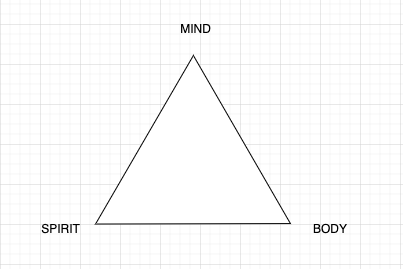

# Iron Triangle

## Mind
- Read 10 mins/day
- Learn something new each year (2023 Drexel Masters of Science)
- Do puzzles

## Body
- Exercise 1 hour/day
- Alcohol moderation
- Carb moderation
- Pack lunch

## Spirit
- Go to church
- Share more
- Don't be ashamed to be human
- Socialize with friends

# My Daily Habits
- 20 mins calistenics each morning (B)
- read 10 mins (M, S)
- 1 hour of phone down family time (S)
- No booze Mon, Tue, Wed 
- pickelball tuesday (B,S)
- basketball wednesday (B,S)
- racquetball thursday (B,S)
- square bar thursday (S)
- golf friday (B, S)
- clean master bedroom saturday (S)
- church sunday (M, B, S)
